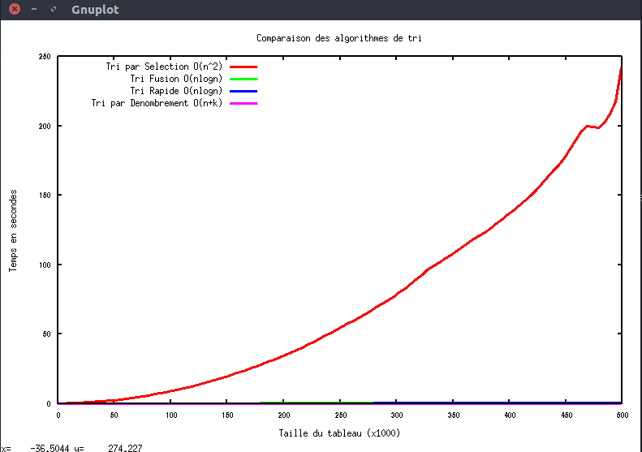
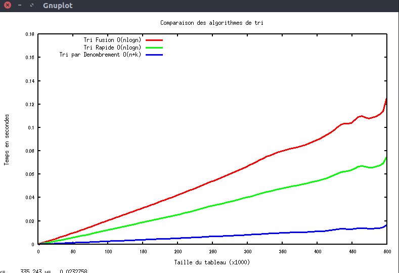

# Sorting Algorithms Comparison in C

This is a C program that runs differents sorting algorithms having different Time Complexities on multiple array sizes in order to compare and visualise execution time of each methode.

## Built with

- C langage
- Gnuplot (to plot the results saved in [matrix.dat](src/matrix.dat))

## Prerequisites

Before compiling the program, make sure you have installed: 

- gcc
- gnuplot

## Usage

```bash
git clone https://github.com/Otman404/Sorting-Comparison-C.git

cd Sorting-Comparison-C/src

make run

```

This will launch the program with an array of an initial size of 1000 that increases by 1000 in each iteration till he gets to a max size of 500000.(can be modified in [tri.c](src/tri.c))

Execution time of each sorting algorithms in each size will be saved in a .dat file (matrix.dat) that will be used later by Gnuplot to plot it.

### Used Sorting algorithms

- Selection Sort O(n²)
- Merge Sort O(nlogn)
- QuickSort O(nlogn)
- Counting Sort O(n+k) 

## Plot

- All implemented sorting algorithms



Notice that Selection sort execution time is so big making other sorts data harder to read.

Let's remove the O(n²) algorithms and see.


